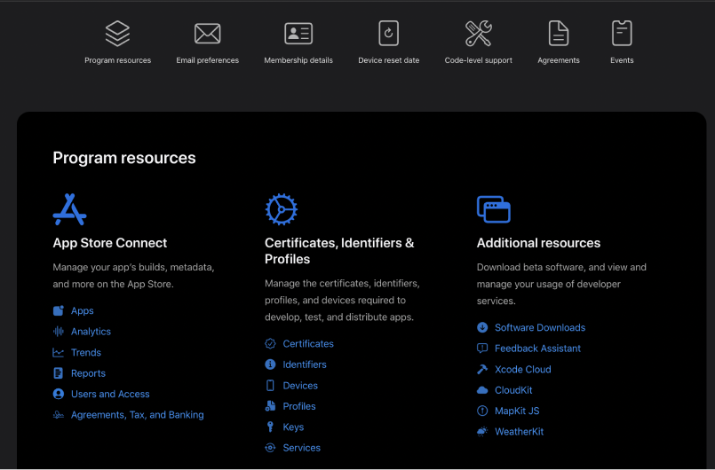

<p align="center">


</p>
<h1 align="center">Developer Guide</h1>

## 📝 Table of Content
- [About](#about)
- [Project Set up](#setup)
- [Project Architecture](#archi)
- [Development](#dev)
- [Deployment](#dep)
- [TODO](#imp)

## 🧐 About  <a name = "about"></a>

Syeta Flutter Viewmodel starter kit.

## 🏁 Project Set up  <a name = "setup"></a>

### Running the app

- Clone the repository and run pub get
```bash
flutter pub get
```
- Run on dev flavor
```bash
flutter run -t lib/main_dev.dart --flavor=dev
```

### IDE Setup
Android studio is the recommended IDE for the development.
#### Plugins
- [ Json To Dart Bean Action ](https://plugins.jetbrains.com/plugin/11415-flutterjsonbeanfactory-only-null-safety-) - Generating Dart model classes.
-  [Git Commit Message Helper ](https://plugins.jetbrains.com/plugin/11415-flutterjsonbeanfactory-only-null-safety-) - Standardizing the commit messages.
#### Build Configurations
Access the build configurations through the edit configurations button.

<p align="center">
 </p>


To get the Dev flavor set the build configuration like below by setting the build flavor to dev and selecting the corresponding data entry file.

<p align="center">
 </p>


## 📐 Project Architecture  <a name = "archi"></a>
MVVM design pattern is used as the basic architecture of the project and for the state management provider pattern is being used.

### Packages Used
- [ Stacked ](https://pub.dev/packages/stacked)
  View and View Model classes used is MVVM architecture is provided by Stacked.
- [Stacked Service](https://pub.dev/packages/stacked_services)
  Used to reduce the boilerplate when using Navigation service, Dialog service, Snackbar service and  Bottom sheet service.
- [Get_it](https://pub.dev/packages/get_it)
  Used by the 'Stacked Service' for routing.
- [Dio](https://pub.dev/packages/dio)
  API handling.
- [Build Runner](https://pub.dev/packages/build_runner)
  Used as a dev dependency for generating routes.

>  Basically combination of above mentioned packages created the overall architecture of the app. There are few other packages which are used to do the feature specific tasks like calenders , reactive form feild components.


### Project Structure

```
.
+-- pubspec.yaml
+-- CHANGELOG.md
+-- release-notes.txt
+-- lib
|   +-- assets
|  |  +-- fonts
|  |  +-- icons
|  |  +-- images
|   +-- core
|  |  +-- config
|  |  |  +-- router
|  |  |  |  +-- router.dart
|  |  |  +-- application.dart
|  |  +-- constants
|  |  +-- enums
|  |  +-- methods
|  |  |  +-- util.dart
|  |  +-- models
|  |  +-- services
|  |  |  +-- api
|  |  |  |  +-- api.dart
|  |  |  |  +-- api_client.dart
|  |  |  |  +-- api_provider.dart
|   +-- generated
|   +-- ui
|  |  +-- theme
|  |  +-- views
|  |  +-- widgets
|   +-- app.dart
|   +-- locator.dart
|  +-- provider_setup.dart
|  +-- main_dev.dart
|  +-- main_qa.dart
|  +-- main_uat.dart
|  +-- main_demo.dart
|  +-- main_live.dart
.
```
Whole source code mainly divided in to 3 folders as 'assets', 'core' and 'ui'. 'assets' contains fonts, icons and images. 'ui' contains the screen vise views and view models and other widgets. 'core' contains all the other configurations, services, models and utility methods.

### Build Flavors
All the configurations for the build flavors are included in side lib/core/application.dart.
currently there are 5 build flavors namely dev, qa, uat, demo and live.
For the 5 build flavors there are 5 main files as well.
To run a specific build flavor the below command can be used.

```bash
flutter run -t lib/main_qa.dart --flavor=qa
```

##  👩‍💻 Development  <a name = "dev"></a>

### MVVM Pattern
All the UI components are basically divided in to 2 files as View and ViewModel. Basic structure of the files are as follows
- basic_view.dart
```dart
class BasicView extends ViewModelBuilderWidget<BasicViewModel> {
  const BasicView({Key? key}) : super(key: key);

  ///Build method
  @override
  Widget builder(BuildContext context, BasicViewModel viewModel, Widget? child){
     /// variables and methods inside the view model can be accessed
     /// by calling viewmodel.*
     return Center(child : Text ('This is the ${viewModel.name}'));
  }

  /// Variables and services can be passed to the viewmodel via the contructor of
  /// the view model
  @override
  viewModelBuilder(BuildContext context) => BasicViewModel(Provider.of(context));

  /// Init method of the view model
  @override
  void onViewModelReady(BasicViewModelviewModel) => viewModel.init();
}
```
- basic_view_model.dart

```dart
class BasicViewModel extends BaseViewModel {
   /// Variables and services declarations
   final SecureStoreService _secureStoreService;
   final NavigationService _navigationService = GetIt.I.get();
   final String name = 'Basic View';
   /// Constructor with passing required providers and services
   BasicViewModel(this._secureStoreService);

   void init(){
   /// init method with functions to be called when view init
   }
}
```
This pattern could be used for all the widgets and components and not only for the views. Purpose of adhering to this pattern is to increase the readability and to maintain the cleanliness of the code.
####  Guidelines for using MVVM pattern effectively
- Try to keep only the UI related code inside View and business logic inside view model.
- Try to minimize the use of notifyListners() call inside the viewModel.
- Do not call the core services like db_handler and api_provider through the viewModel and try to make those calls via a separate service.

### Provider Setup
For state management provider package is used in this source code.
Setting up a new provider is quite easy and first step is creating a service class inside the lib > core > services. next set is to register it as a provider inside the provider setup. There are few variations in the provider registration considering whether the provider is a change notifier, uses a another service or a single provider.

- provider_setup.dart
```dart
List<SingleChildWidget> providers = [
  ...independentServices,
  ...dependentServices,
];

List<SingleChildWidget> independentServices = [
  Provider.value(value: DialogService()),
  Provider.value(value: SecureStoreService(const FlutterSecureStorage())),
  Provider.value(value: AuthenticationService()),
  Provider.value(value: ApiClient()),
   ...
  ChangeNotifierProvider.value(value: CallHistoryService()),
  ChangeNotifierProvider.value(value: CallDetailingService()),
  ChangeNotifierProvider.value(value: CallSampleService())
  ...
];

List<SingleChildWidget> dependentServices = [
  ProxyProvider<SecureStoreService, CallService>(
    update: (context, client, api) => CallService(client),
  ),
  ProxyProvider<ApiClient, ApiProvider>(
    update: (context, client, api) => ApiProvider(client),
  ),

  ProxyProvider<ApiProvider, UserService>(
    update: (context, api, service) => UserService(api),
  dispose: (context, service) => service.dispose(),
  ),
   ...
];
```
### Routing
Get_it router is used for the generating routes required for the navigation.
In order to set up a new route, first, the view should be registered inside core > config > router > router.dart.
```dart
@StackedApp(routes: [
  AdaptiveRoute(page: SplashView, initial: true),
  AdaptiveRoute(page: LoginView),
  AdaptiveRoute(page: HomeView),
  AdaptiveRoute(page: ContactsView),
  AdaptiveRoute(page: DashboardView),
  AdaptiveRoute(page: ExpensesView),
  AdaptiveRoute(page: ImageCaptureView),
  ...
  /// add the new route here as a AdaptiveRoute
])
class $Router {}
```
Then, the following build runner command needs to be executed in order to generate the other required files.
```bash
flutter pub run build_runner build --delete-conflicting-outputs
```
After running the build runner those registered routes can be used view the viewModels as follows.

```dart
/// Initializing the Navigation service
final NavigationService _navigationService = GetIt.I.get();
...
/// Replacing a view
_navigationService.replaceWith(Routes.homeView);
/// Navigating to a view
_navigationService.navigateTo(Routes.homeView);
/// Like them there are many other methods inside the
/// Navigation Service class that could be used for the effective routing
```

### API handling
All the code required for API handling is inside lib > core > services > api.
There are 3 main files.

- api.dart - abstract class for all the api endpoints.
- api_porvider.dart - actual implementation of the api abstract class.
- api_client.dart - core functions for handling get, post requests and handling the responses.


### Generating model classes
JSON response can be direclty used for generating the dart model class by 'Json to Dart Bean Action' plugin.

- Open the 'Json to Dart Bean Action' plugin in the correct directory.
 <p align="center">
 </p>

- Then name the class and paste the api response and click 'Make' to generate the required Dart model.
 <p align="center">
 </p>
Now the required model class along with the fromJson() and toJson() methods are generated.

### Recommended coding standards

- When importing files which are in the same repo, try to use the actual location forman (ex: '../../core/services/api/api_provider.dart') and not with the package name.

## 🚀 Deployment <a name = "dep"></a>

### Version Control
There are 3 main branches which are used for the development and release.

- dev - maintained as the development branch.
- main - maintained as the master branch and not doing any direct development tasks on this branch.
- stable - used for the version releases.

when developing a feature or fixing a bug, always create a branch from the dev branch and once the development is completed put a merge request and merge to the dev branch.

### Commit messages

Commit messages are used when generating the release notes. So There is a standard when it comes to the commit messages.
This can be easily followed by using the git commit message helper plugin.

 <p align="center">
 </p>

### Releasing a version
Before doing a release first, all the the feature and bug fixes branches needs to be merged to the dev branch.
Then run git fetch to get all the released versions and tags.
Next step is to increasing the version number in pubspec.yaml file.
This version number is in the form of:
> v0.4.2(23)
>
Here;
last number is the build number and it should be increased by 1 for each release.
0 means the major version number (Since the app is in the pre release it is 0)
4 is the epic number (each time when a new epic is released this should be increased by 1)
2 is the incremented by 1 when there are small fixes.

#### Generating release notes
Run the following command to generate the release-notes.txt file.
```bash
 git log --pretty="- %s (%an)" v0.4.1+25..HEAD > release-notes.txt
```
Version number used here should be the previously released tag version.

- This command populates the release-notes.txt file with the commit messages which were done after the previous release.
- Then copy the content of the release-notes.txt file to the top of the CHANGELOG.md file and add the specific date and the version numbers.
#### Creating the tag
After the 3 files (pubspec.yaml, release-notes.txt, CHANGELOG.md) are updated new release commit has to be made with a commit message of:
```
build:(New Release)
```
- After the build commit to dev branch, the dev branch needs to be merged in to the main branch via a merge request.
- Then the main branch should be merged to the stable branch via a merge request.
- Then a new tag can be created in the repository, Make sure that the tag name is the correct version number and the branch is selected as stable.

```bash
git tag -a v0.2.0 -m "Released v0.1.0"
```
- Then the created tag can be pushed to the repository
```bash
git push origin v0.2.0
```

#### Distributing the version via firebase
To generate the apk, following command can be executed.
```bash
flutter build apk --flavor qa -t lib/main_qa.dart
```

This command generates a apk with the current version and the selected flavor and it outputs the location of the generated apk.
Then go the > Firebase console >  select Vantage MRIS as project > app destribution > Select the correct build flavor > upload the apk > add release notes and distribute to testers.
 <p align="center">
 </p>

### Ios distribution
After getting the Ios Developer account following procedure has to be followed for the test flight distribution.

- After the successfull registration of the developer account, the ios developer account dashboard should be look like this.
 <p align="center">
 </p>

- First step is to create and identifier, By following the below process an identifier could be created.
 <p align="center">
 </p>
 <p align="center"> </p>
 <p align="center"> </p>

- After creating an identifier, an certificate can be created.
 <p align="center">
 </p>
at the end of the certificate creation process an certificate file is available to download and it should be download and saved.

- Next open the keychain tool and from Files > Certificates > request a certificate and selected the downloaded file.
- Then open up the Xcode with Runner.xcworkspace of the project.
 <p align="center">
 </p>

- Then after going to the signing and capabilities tab, select the correct team and it will detect the correct certificate.
- Select  'any Ios device' from the device list.
- Then go to product in the top bar and Archive.

- Then it should open up the distribution window as follows.
 <p align="center">
 </p>

- First validate app and distribute the app.
- Then this app build should be visible in the app store connect 'tesflight' account and by adding test accounts the app can be distributed among the testers.

# TODO <a name = "imp"></a>
 - [ ] Creating branches for separate versions.


---
🙂 Happy Coding ✌️
